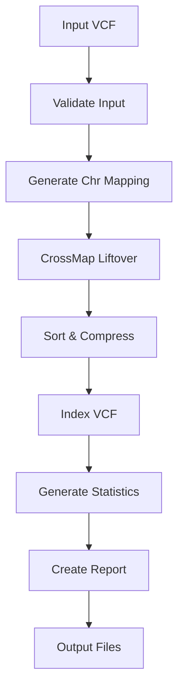

# Process Flow

This page describes the detailed execution flow of the VCF liftover pipeline.

## Pipeline Architecture

The VCF liftover pipeline follows a linear workflow with quality control and validation at each step.

## Process Diagram

## Process Details

### 1. Input Validation

**Process**: `VALIDATE_INPUT`

- Checks VCF file format
- Verifies file is bgzipped
- Ensures index file exists
- Validates reference genome

**Outputs**: Validated VCF file

### 2. Chromosome Mapping Generation

**Process**: `GENERATE_CHR_MAPPING`

- Detects chromosome naming conventions
- Creates mapping file if needed
- Handles prefix differences (chr1 vs 1)

**Outputs**: Chromosome mapping file (if needed)

### 3. CrossMap Liftover

**Process**: `CROSSMAP_LIFTOVER`

- Performs coordinate conversion
- Uses chain file for genome build mapping
- Applies chromosome name mapping
- Separates lifted and unlifted variants

**Inputs**:
- Input VCF
- Target reference FASTA
- Chain file
- Chromosome mapping (optional)

**Outputs**:
- Lifted VCF
- Unlifted variants (if any)

### 4. Sort and Compress

**Process**: `SORT_AND_COMPRESS`

- Sorts VCF by genomic position
- Compresses with bgzip
- Ensures proper VCF formatting

**Outputs**: Sorted, compressed VCF

### 5. Index VCF

**Process**: `INDEX_VCF`

- Creates tabix index
- Enables random access
- Required for downstream tools

**Outputs**: `.tbi` index file

### 6. Generate Statistics

**Process**: `GENERATE_STATISTICS`

- Counts total variants
- Calculates success rate
- Generates per-chromosome statistics

**Outputs**: Statistics text file

### 7. Create Report

**Process**: `GENERATE_REPORT`

- Creates HTML report
- Visualizes statistics
- Provides quality metrics

**Outputs**: HTML report file

## Resource Usage

See [Resource Usage](resources.md) for detailed resource requirements per process.

## Error Handling

Each process includes:
- Input validation
- Error checking
- Meaningful error messages
- Automatic retry on failure (configurable)

## Next Steps

- [Subworkflows](subworkflows.md) - Understand workflow composition
- [Resource Usage](resources.md) - Optimize resource allocation
