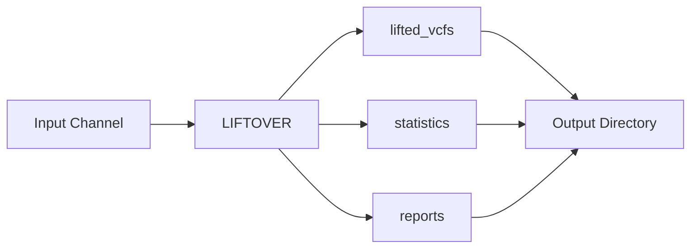

# Subworkflows

The VCF liftover pipeline is organized into modular subworkflows for maintainability and reusability.

## Workflow Structure

### Main Workflow

**Location**: `main.nf`

The main workflow orchestrates the entire pipeline execution:

```groovy
workflow {
    // Input validation
    validateInputs()

    // Liftover workflow
    LIFTOVER(
        input_vcf,
        target_fasta,
        chain_file
    )

    // Post-processing
    postProcess(LIFTOVER.out)
}
```

### LIFTOVER Subworkflow

**Location**: `workflows/liftover.nf`

Core liftover logic:

1. Generate chromosome mapping (if needed)
2. Run CrossMap
3. Sort and compress output
4. Index VCF
5. Generate statistics
6. Create report

**Inputs**:
- `input_vcf`: Channel of input VCF files
- `target_fasta`: Reference genome FASTA
- `chain_file`: CrossMap chain file

**Outputs**:
- `lifted_vcf`: Lifted VCF files
- `statistics`: Liftover statistics
- `reports`: HTML reports

## Module Organization

### Process Modules

**Location**: `modules/`

Individual process definitions:

- `crossmap.nf` - CrossMap execution
- `sort_vcf.nf` - VCF sorting and compression
- `index_vcf.nf` - Tabix indexing
- `generate_stats.nf` - Statistics generation
- `generate_report.nf` - Report creation
- `generate_chr_mapping.nf` - Chromosome mapping

Each module is self-contained and reusable.

## Input Channels

### Single File Input

```groovy
Channel
    .fromPath(params.input)
    .map { file -> tuple(file.baseName, file) }
    .set { input_ch }
```

### CSV Batch Input

```groovy
Channel
    .fromPath(params.input)
    .splitCsv(header: true)
    .map { row -> tuple(row.sample, file(row.vcf)) }
    .set { input_ch }
```

## Output Channels

Organized by output type:

- `lifted_vcfs` - Main outputs
- `statistics` - QC metrics
- `reports` - HTML reports
- `logs` - Process logs

## Parallel Execution

The pipeline automatically parallelizes across:

1. **Multiple samples** - Process files independently
2. **Process steps** - Run independent processes in parallel
3. **Resource allocation** - Nextflow manages CPU/memory

## Data Flow



## Customization

### Adding New Processes

1. Create module in `modules/`
2. Add to `workflows/liftover.nf`
3. Update input/output channels
4. Test with `-profile test`

### Modifying Workflows

Edit `workflows/liftover.nf` to:
- Add conditional logic
- Include optional steps
- Modify data flow

## Best Practices

- Keep processes single-purpose
- Use channels for data flow
- Validate inputs early
- Provide meaningful process names
- Include error handling

## Next Steps

- [Process Flow](process-flow.md) - Detailed process execution
- [Resource Usage](resources.md) - Resource requirements
